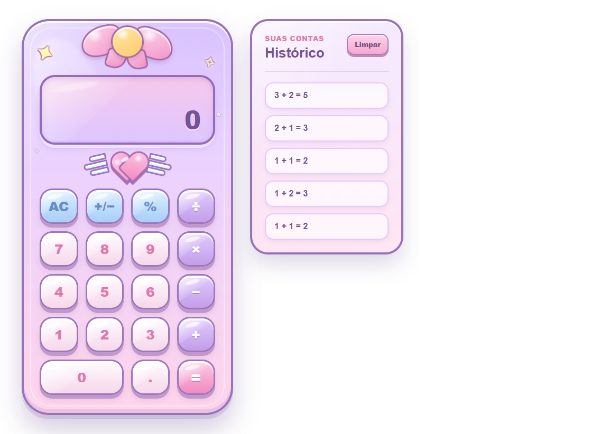

# Kawaii Calculator

Uma calculadora com visual kawaii desenvolvida utilizando **TypeScript**, **SCSS** e **Vite**.

O projeto foi criado com foco em praticar desenvolvimento front-end moderno, organização de código e versionamento com Git e GitHub.

## Preview



## Funcionalidades

- ➕ Soma
- ➖ Subtração
- ✖️ Multiplicação
- ➗ Divisão
- 🔢 Números decimais
- 📊 Cálculo de porcentagem
- 🔄 Inversão de sinal (+/-)
- 🧹 Limpar cálculo (AC)
- ⌨️ Suporte ao teclado
- 📝 Histórico de cálculos
- 💾 Histórico salvo automaticamente no navegador (LocalStorage)
- 📱 Interface responsiva
- 🎀 Design kawaii

## Tecnologias utilizadas

- HTML5
- TypeScript
- SCSS
- Vite
- Git
- GitHub

## Como executar o projeto

Clone o repositório:

```bash
git clone https://github.com/michellebnn/calculator.git
```

Entre na pasta:

```bash
cd calculator
```

Instale as dependências:

```bash
npm install
```

Execute o projeto:

```bash
npm run dev
```

Para gerar a versão de produção:

```bash
npm run build
```

## Estrutura do projeto

```
calculator/
│
├── public/
├── src/
│   ├── calculator/
│   ├── main.ts
│   └── style.scss
│
├── index.html
├── package.json
└── README.md
```

## Autora

Desenvolvido por **Michelle**.

GitHub:
https://github.com/michellebnn